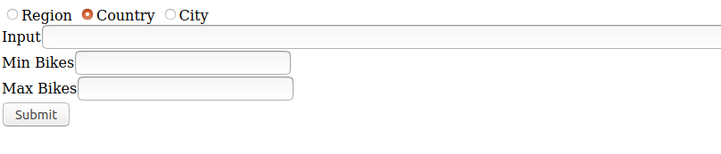
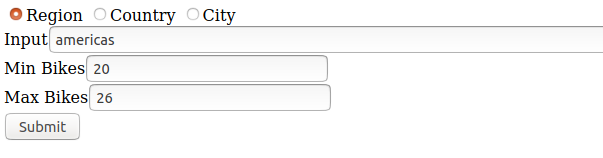
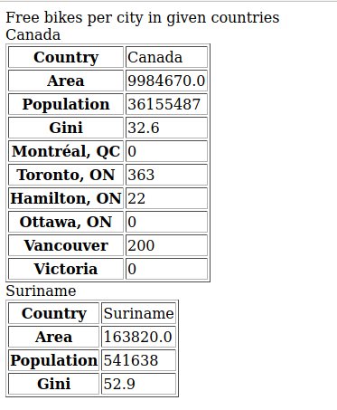
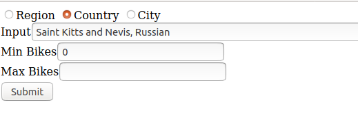
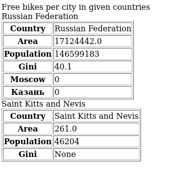
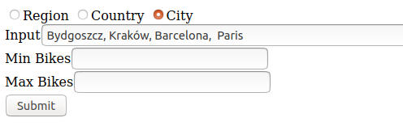
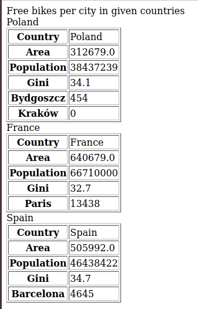

# Rest API to get contry statistics + free bikes avaliable in your station

## Overview

APP with Static form and server which uses REST API's described in `server/README.md`.  

As an input you provide either Countries, Cities or one region. As an output you will always have the tables with:
* Country name
* Country area
* Country population
* Country gini coefficient
* Pairs (City, Number of free bikes in given city)

## Requirements

**Python3** with **venv** installed

## Run server

 `bash start.sh`

## Usage

With server up and running, open browser `http://localhost:5000/`  
There should be static form displayed

You can chose on of those 3 requests
* Region - one of the following `africa, americas, asia, europe, oceania`
* Country - country native names or partial names separated by commas 
* City - native city names separated by commas

All the queries should be in the written in the `Input` field 

Additional field (not required, can be empty)
* Min Bikes - Minimum number of bikes in the station to be processed
* Max Bikes - Maximum number of bikes in the station to be processed

### Example inputs and outputs

**Region** 
 

 **Country** 
 

 **City** 
 

### Notes

* API for Region return much more countries than we can process in reasonable time, so we decided to just get 2 random coutry.
* If you are using partial names for countries and there will be ambiguity, the country will not be processed. (For example FRA will return both "France" and 	"French Polynesia" due to the restcountries API).
* The names for cities and region has to be exact, as there is a exact route for a request.
* If you are using multiple inputs for city or country (separated by commas), spaces doesn't matter they will be stripped.
* Min/max bikes only specify the interval for which we are adding the bikes, there always will at least 0 in the output per city as long as the city is occurs in the citybike API.